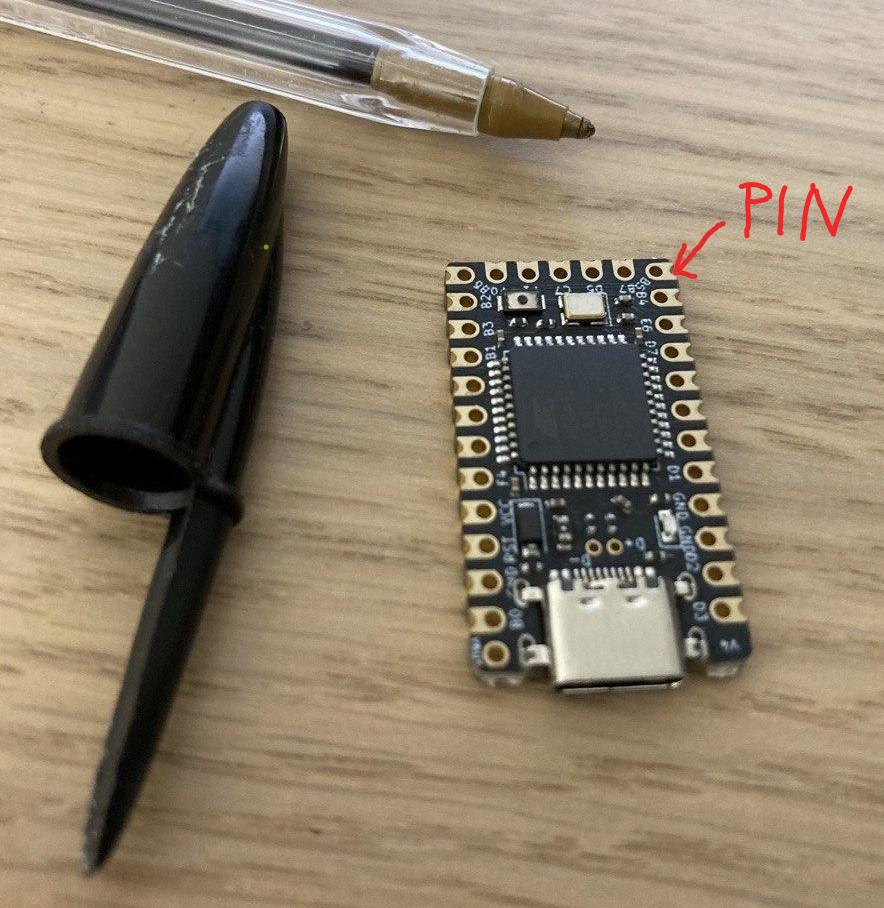
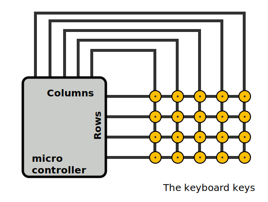
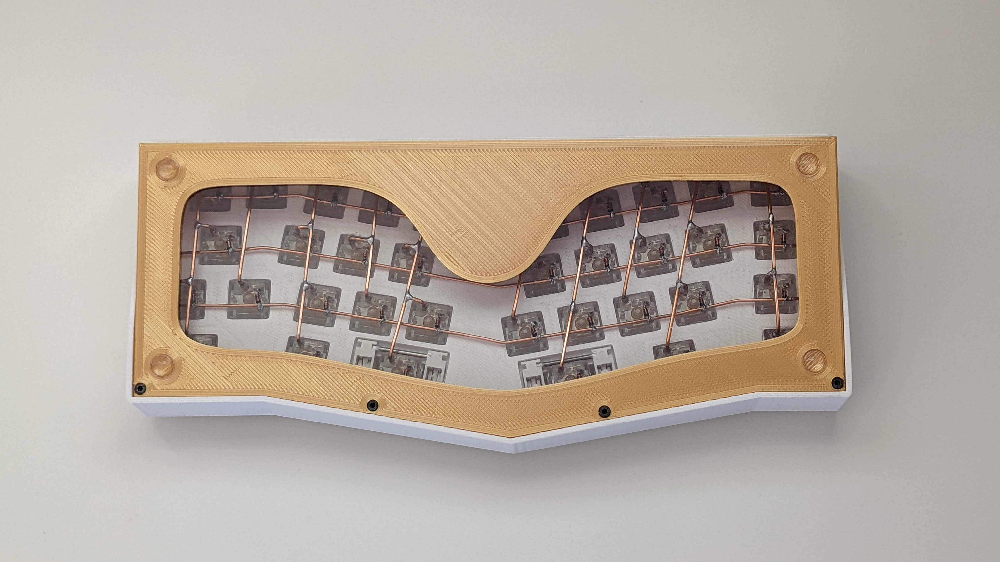
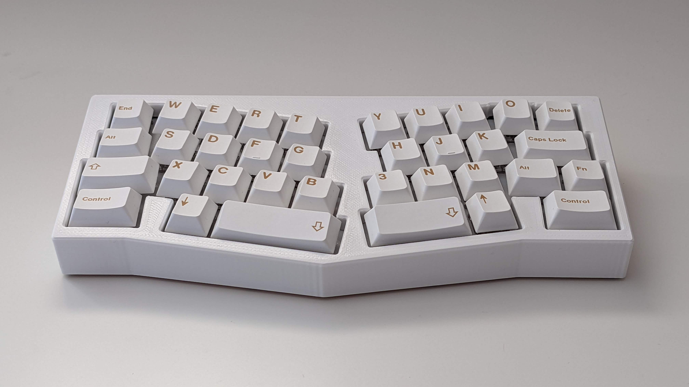

Title: Keyboard Matrix
Date: 2022-05-30
Slug: keyboard-matrix
Summary: Quels système permet de réduire le nombre de PIN nécéssaires pour faire un clavier ?
Category: Mai22

    <h1>Le circuit électrique des claviers</h1>
     
    

        Un clavier, c'est simple. Il s'agit simplement d'un ensemble d'interrupteurs: les touches. 
        Le problème c'est qu'il y en a beaucoup, généralement autour d'une centaine. Ce qui veut dire qu'on devrait avoir
        au moins un PIN par touche dans notre microcontrôleur (le petit processeur qui gère le circuit électrique du clavier).
         
        Or, il n'y en a pas autant:
    

    

    

        Sur l'image, il s'agit du microcontrôleur Elite C, avec 24 PIN utilisables, le reste étant réservé
        pour l'entrée et sortie du courant ainsi que la Terre.
    

    

        En bref, pour qu'on puisse faire un clavier avec moins de PIN,  l'idée a été de transmettre une partie de la complexité au microcontrôleur en construisant un circuit en matrice (Keyboard matrix).
    

    

        
        <h4> Avec columns+rows PINs on peut gérer colums*rows touches. </h4>
    

    

        Cela est fait de la façon suivante: le microcontrôleur parcourt à haute fréquence chaque colonne en y faisant passer un courant.
        Si une touche est pressée, un courant fera la jonction entre la colonne et la ligne, exemple D et 3. Au préalable, nous auront flashé la <a href="https://fr.wikipedia.org/wiki/M%C3%A9moire_morte">ROM</A> du microcontrôleur avec une configuration indiquant à quel caractère unicode D3 correspond. Le microcontrôleur sera alors en mesure d'envoyer ce caractère à l'ordinateur.
    

    

    <h3> Et voilà ! </h3>
    

        Pour aller plus loin et comprendre comment ont été résolu les problèmes de ghosting induits par les matrices, vous pouvez vous référer à la section <b>6. Three Simultaneous Key Presses and Ghosting</b> de 
        <a href="https://www.dribin.org/dave/keyboard/one_html/">cet article</a>. Mais pour faire simple, il s'agit simplement d'ajouter une diode par touche !
    

     
    

        Sources:  
        <a href="https://www.dribin.org/dave/keyboard/one_html/">cet article</a> 
        <a href="https://www.pcbheaven.com/wikipages/How_Key_Matrices_Works/">pcbheaven</a>
    

    

        Clavier mécanique soudé à la main avec circuit en matrice visible:
    

    
    
    Les images ci-dessus proviennent du repo <a href="https://github.com/flurples/C-13X">github.com/flurples/C-13X</a>, open sourcé avec courtoisie.

