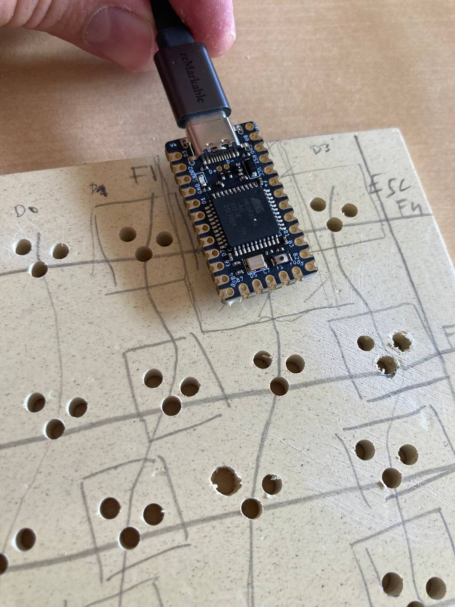
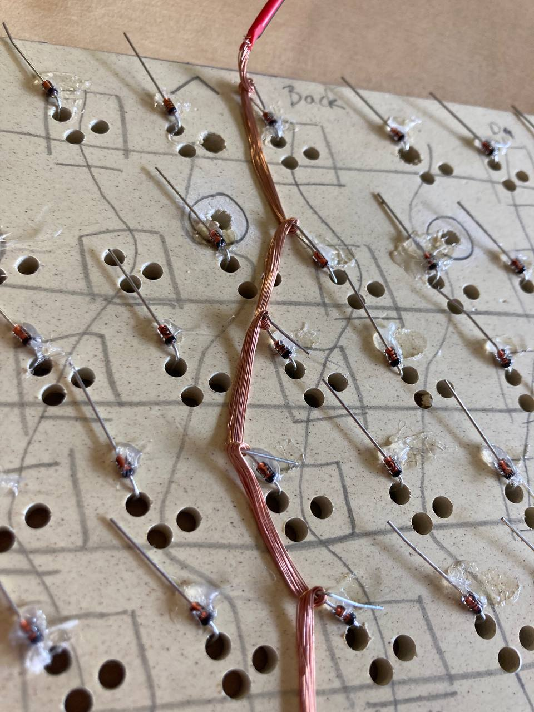
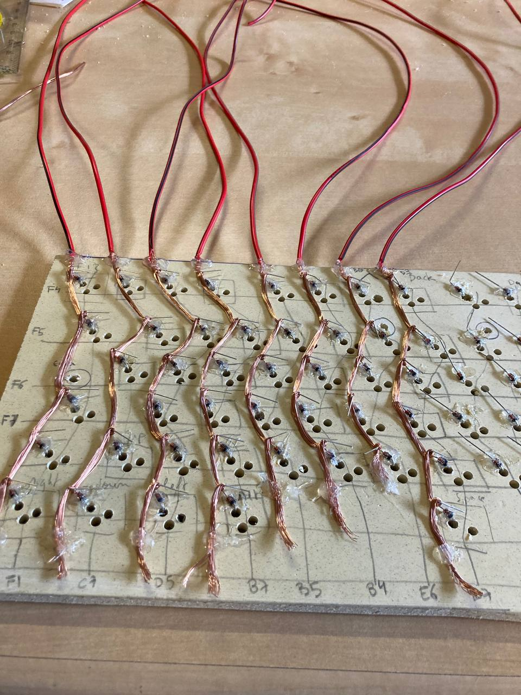
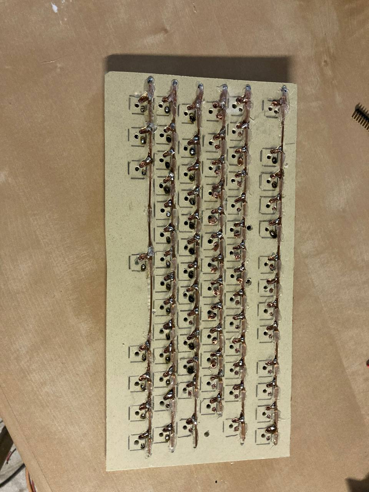
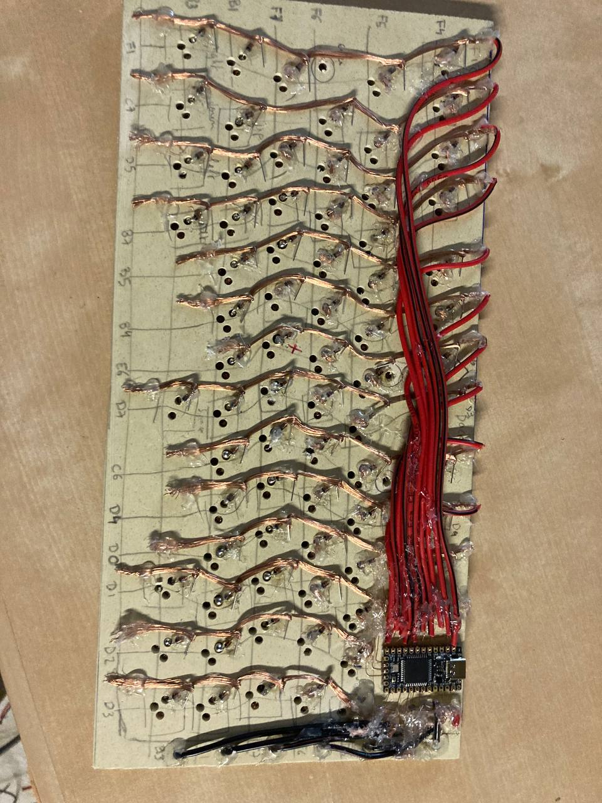
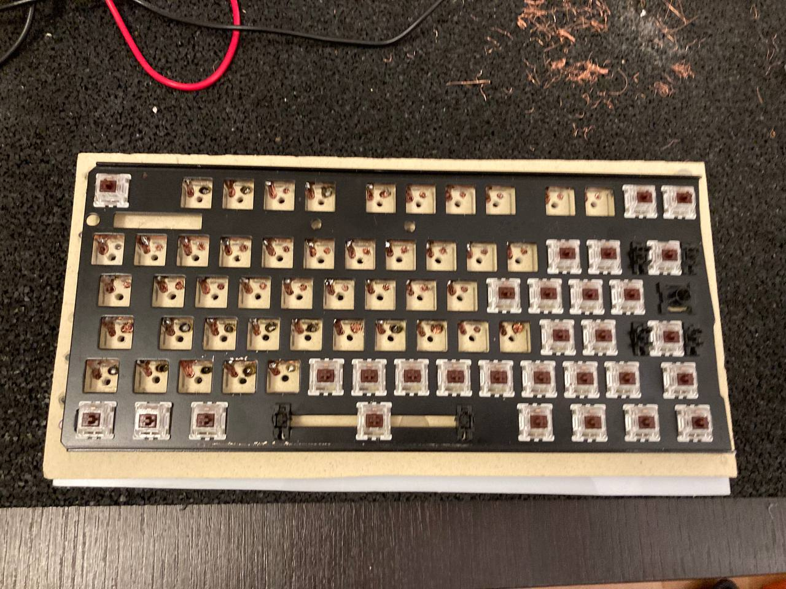
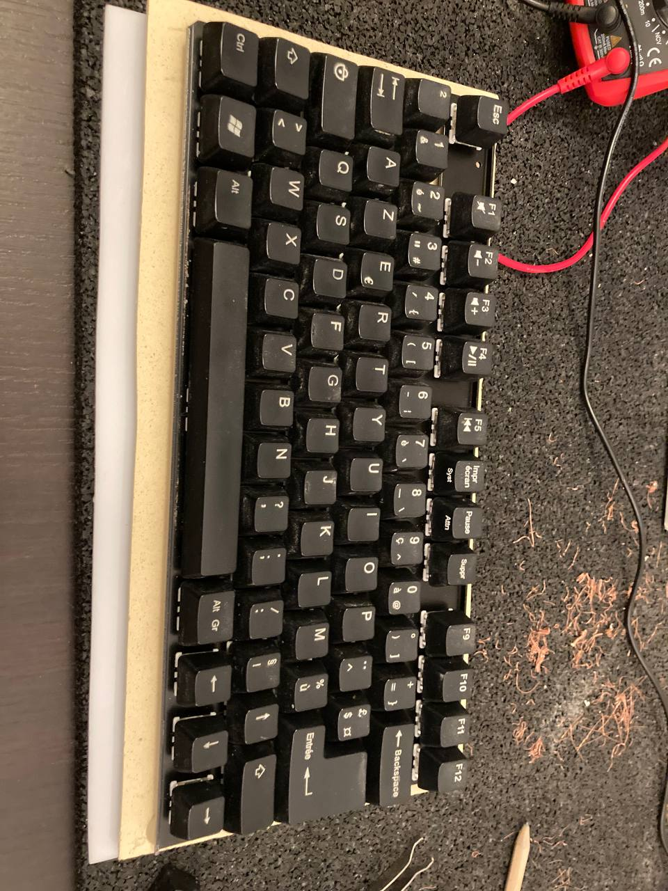

Title: J'ai construit mon clavier moi-même
Date: 2022-07-30
Summary: Il m'a fallu une semaine de vacances, c'était un peu fou
Category: Juillet22

    <h1>J'ai construit mon clavier moi-même</h1>
     
    

        Pourquoi ? 
        <ul>
            <li>Pour obtenir exactement ce dont j'ai besoin.</li>
            <li>Pour comprendre comment ça marche et pouvoir le réparer si besoin.</li>
        </ul>
        Un clavier en grande partie fait de recyclage: les fils de cuivre ont été récupérés d'ancien câbles électriques, 
        la plaque sur lequel reposent le circuit est faite en partie de bois recyclé, la plaque pour soutenir les switchs a été récupérée d'un vieux clavier.
        Le peu de soudures permet un réparage facile.
    

    

        Un clavier presque intégralement fait au pistolet à colle.
        Il m'a servi pour l'adhésion des composants à la plaque, d'isolant, de support..
    

    <h4>Configuration du microcontrôleur</h4>
    

        
        <h4> 0 </h4>
    

    

        
        <h4> 1 </h4>
    

    <h4>Comment faire la plaque sur laquelle on posera les switchs</h4>
    

        Réponse: en coupant un vieux clavier en deux (et en ne gardant que la partie de gauche).
        Switchs sur lesquels reposeront les touches.
    

    

        
        <h4> 0 </h4>
    

    <h4>Réalisation du circuit électrique</h4>
    

        Presque sans soudures. Je n'avais pas décapé les fils de cuivres, donc cela a rendu les soudures complexes (l'étain glissait sur le cuivre).
        J'ai donc du trouver des systèmes d'enroulement de fils pour que le contact se fasse quand même. L'avantage, c'est que ça se démonte/remonte plus
        facilement que si l'on devait désouder.
    

    

        
        <h4> 0 </h4>
    

    

        
        <h4> 1 </h4>
    

    

        
        <h4> 2 </h4>
    

    

        
        <h4> 3 </h4>
    

    

        
        <h4> Face avant, réalisation des lignes </h4>
    

    

        
        <h4> Une fois la jonction des colonnes (rouges) et lignes (noires) avec le microcontrôleur faite. La petite taille de ce dernier n'a pas rendu la tâche facile. </h4>
    

    <h4>Fixer les switchs, et les touches</h4>
    

        
        <h4> 0 </h4>
    

    

        
        <h4> 1 </h4>
    

    

        
        <h4> 2 </h4>
    

    <h4>TODO: le boîter</h4>
    
Pour donner un petit charme à l'ensemble

        

        
        <h4> La plaque en PVC blanche qui m'a tapée dans l'oeil </h4>
    

    

        
        <h4> S'inspirer d'un autre clavier </h4>
    

    

    

