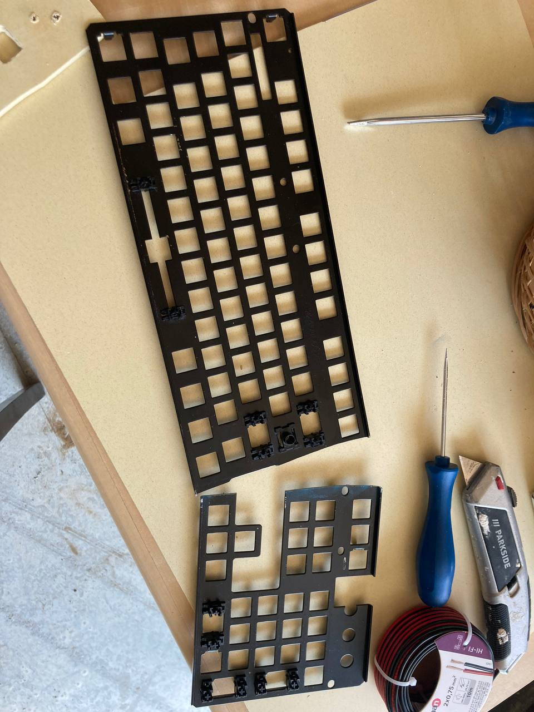
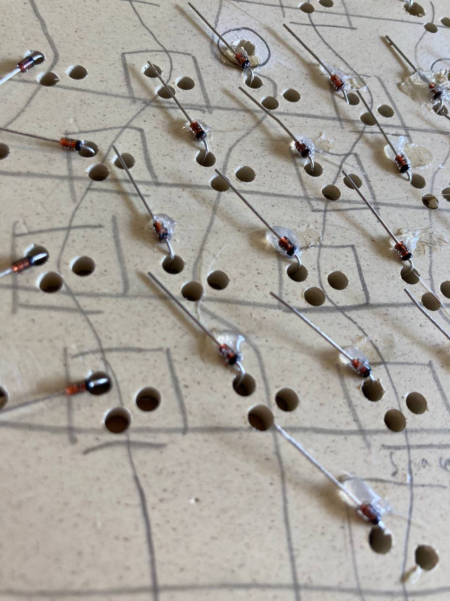
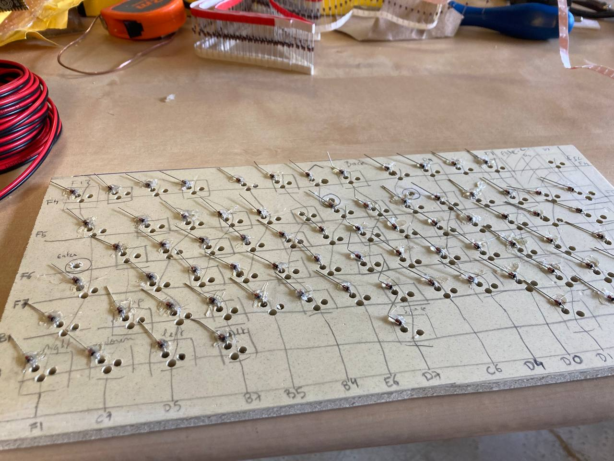
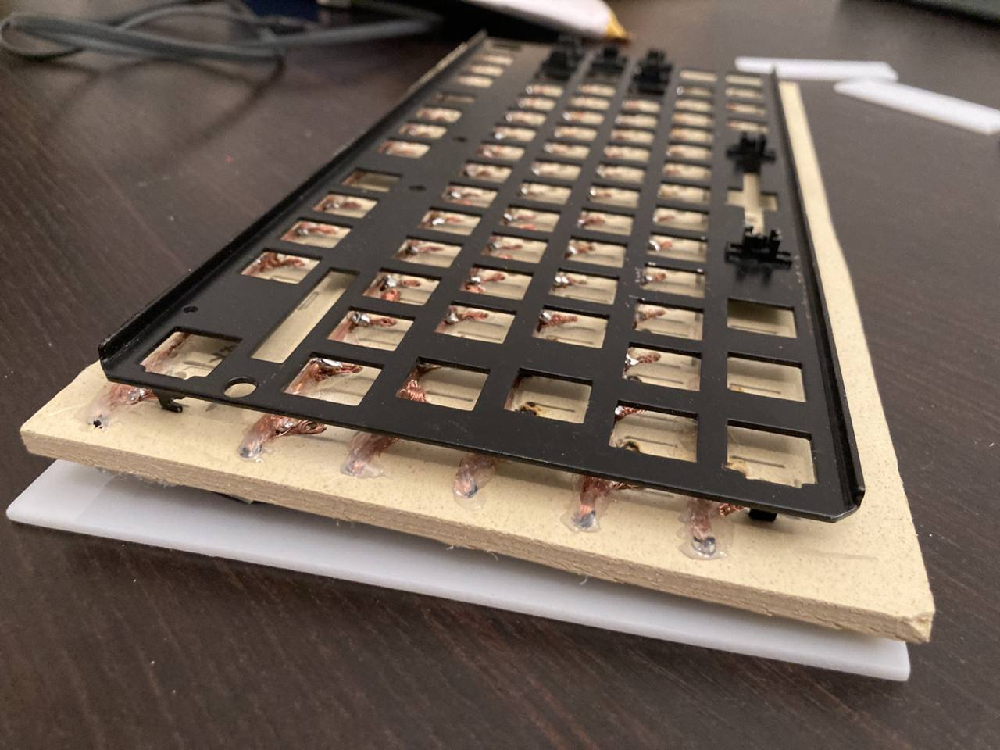
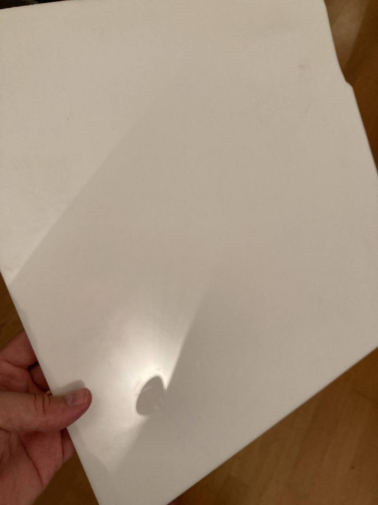
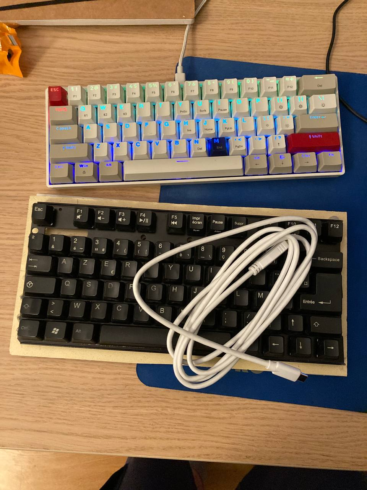
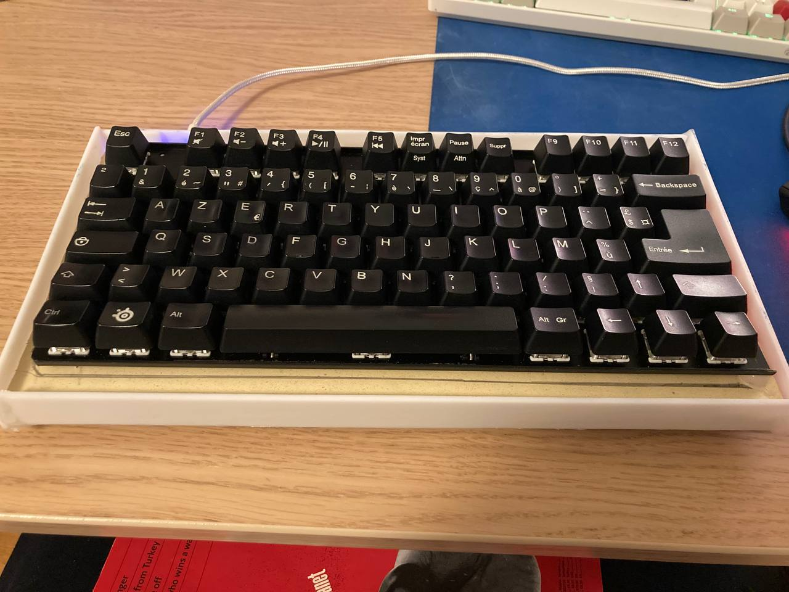

Title: Construire un clavier .. artisanal
Date: 2022-07-30
Summary: Il m'a fallu une semaine de vacances, c'était un peu fou
Category: Juillet22

    
    <h1>J'ai construit mon clavier moi-même</h1>
     
    

    "Et pourquoi tu fais ça ?"
        <ul>
            <li>- Pour obtenir une disposition minimale en supprimant des touches inutiles.</li>
            <li>- Pour comprendre comment ça marche et pouvoir le réparer si besoin.</li>
        </ul>
         
        Un clavier en grande partie fait de recyclage: les fils de cuivre ont été récupérés d'anciens câbles électriques, 
        la plaque sur laquelle reposent le circuit est faite en partie de bois recyclé, la plaque pour soutenir les switchs a été récupérée d'un vieux clavier.
        Le peu de soudures permet un réparage facile.
    

    

        Fait amusant, le clavier est presque intégralement fait au pistolet à colle.
        Il m'a servi pour l'adhésion des composants à la plaque, d'isolant, créer des séparations/supports entre les diverses plaques..
    

    <h4>Configuration du microcontrôleur</h4>
    

        
        <h5> Flasher le firmware en utilisant QMK. Il a fallu connecter les PINs Ground et Reset pour mettre le microcontrôleur en mode DFU.</h5>
    

    

        
        <h5> Se réserver un endroit où mettre ce petit bout d'ordinateur. </h5>
    

    <h4>Comment faire la plaque sur laquelle on posera les switchs</h4>
    

        Réponse: en coupant un vieux clavier en deux et en ne gardant que la partie de gauche.
        J'ai effectivement remarqué que bcp de touches étaient inutiles, comme toutees les touches à droite de Alt Gr. Je les ai remplacées par
        les touches de directions.
        Le pavé numérique est souvent inutilisé également (j'utilise régulièrement les touches F1 à F5 et F9 à F12 en revanche).
        Cela fait gagner de la place horizontale et permet d'utiliser sa souris avec moins d'inconfort.
    

    

        
    

    <h4>Réalisation du circuit électrique</h4>
    

        Presque sans soudures. Je n'avais pas décapé les fils de cuivres, donc cela a rendu les soudures complexes (l'étain glissait sur le cuivre).
        J'ai donc dû trouver des systèmes d'enroulement de fils pour que le contact se fasse quand même. L'avantage, c'est que ça se démonte/remonte plus
        facilement que si l'on devait désouder.
    

    

        
    

    

        
    

    

        
        <h5> Enrouler les fils de cuivre autour des diodes, cela est presque artistique :) </h5>
    

    

        
    

    

        
        <h5> Face avant, réalisation des lignes </h5>
    

    

        
        <h5> Une fois la jonction des colonnes (rouges) et lignes (noires) avec le microcontrôleur faite. La petite taille de ce dernier n'a pas rendu la tâche facile. </h5>
    

    <h4>Fixer les switchs, et les touches</h4>
    

        
        <h5> les trois couches d'un clavier: Boitier (en blanc), PCB (circuit électrique), et Plate </h5>
    

    

        
        <h5> Mise en place des switchs (Gateron Brown) </h5>
    

    

        
        <h5> Puis les touches (récup). </h5>
    

    <h4>TODO: le boîter</h4>
    
Pour donner un petit charme à l'ensemble

        

        
        <h5> La plaque en PVC blanche qui m'a tapée dans l'oeil </h5>
    

    

        
        <h5> Comparaison avec un autre clavier (et achat d'un solide câble USB-C blanc).</h5>
    

    

        
        <h5> Une fois la partie inférieure du boîtier faite, il me semble évident que la partie haute doit être faite très précisemment car elle compte pour bcp dans l'ésthétique générale du clavier. Je m'en remets à une impression 3D pour cette partie là. </h5>
    

    

    

