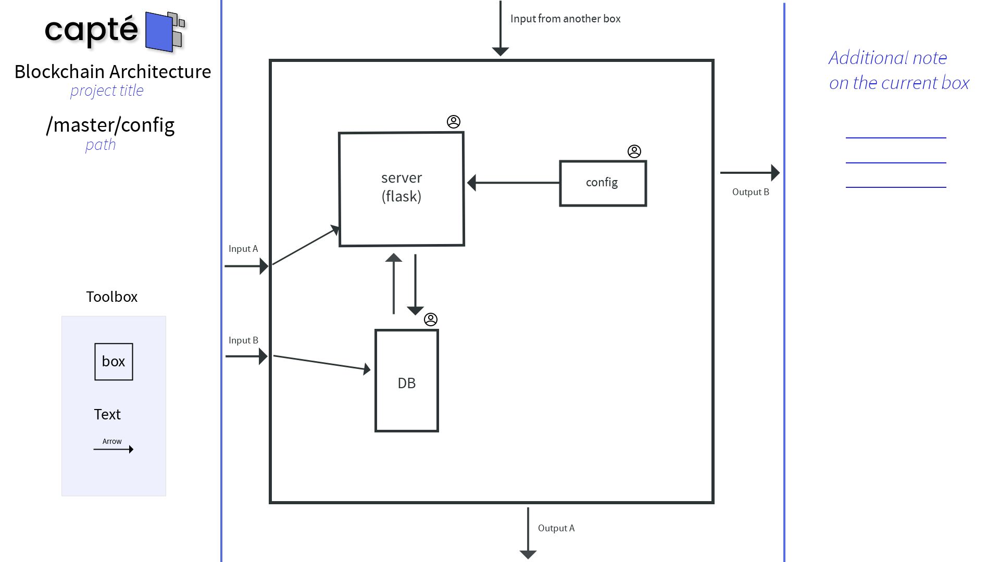

Title: capté
Date: 2022-04-30
Slug: capte-project-management
Summary: Une seule source de vérité pour vos projets
Category: Avril22

    <h1>capté, outils de management et de description de projet</h1>
     
    

    Voilà un projet dont l'idée ne voulait pas sortir de ma tête, ce qui a finalement débouché
    sur une journée de travail au sein du Project Babbage, histoire d'en faire un Proof of Concept.  
    L'idée m'est venue du fait de la frustration ressentie avec les outils de collaboration visuels existants, ne permettant
    qu'une visualisation trop limitée d'un projet. Actuellement, avec un outils tel que Miro,
    vous dessinez sur un canvas 2D et .. c'est tout. Absolument tout se trouve au même niveau.
     
     
    Avec <b>capté</b>, vous décrivez un niveau de détails (boite), comment il interagit avec les 
    autres boites au même niveau, ainsi que le responsable de ce niveau. Puis vous pouvez rentrer (zoomer) dans ce niveau
    pour décrire un niveau de détails plus bas exactement de la même façon.
     
     
    Les avantages sont multiples:
    <ul style=>
        <li>- Toute l'équipe peut décrire le projet avec ce système, ce qui en fait la source de vérité de référence.</li>
        <li>- Chacun peut décrire le projet jusqu'au niveau de détails le plus bas souhaité.</li>
        <li>- Chacun sait qui est responsable de quoi.</li>
    </ul>
     
    Le projet va être amené à évoluer, voici le <a href="https://github.com/ProjectBabbage/capt">lien du repo</a>
    

    

